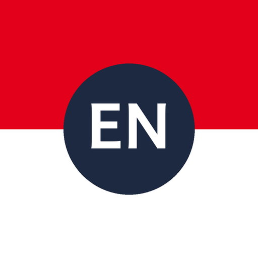

  

<h1 align="center">English Diary</h1>

  Free English vocabulary games for primary school – 4th grade, Hessen curriculum. 
  Works in any browser, installs like an app, and runs offline.

  <a href="https://nadasaleh1991.github.io/kids-english-diary/"><b>▶ Open the app</b></a>

---

## What's inside

**12 topics** from the 4th-grade English workbook: weather & seasons, numbers 1–30, colours, farm animals, pets, fruits, vegetables, family, my body, school things, clothes and at home.

**10 kinds of exercise** for every topic:

| Exercise | What the child does |
|---|---|
| 📖 Learn the words | Sees each word with a picture and German meaning, and hears it spoken |
| 🔤 Choose the word | Picks the English word for a picture |
| 🖼️ Find the picture | Reads a word and taps the matching picture |
| 🎧 Listen and tap | Hears a word and taps the answer |
| 🇩🇪 German → English | Translates a German word |
| ✏️ Write the word | Spells the word with letter tiles |
| 〰️ Draw a line | Matches pairs, e.g. animal and sound |
| 📝 Fill the gap | Completes sentences like "In Hamburg it's ___." |
| 🔍 Find the words | Finds hidden words in a letter snake |
| 🏆 Big test | 12 mixed questions |

After each round, a feedback page ("Rückmeldung") shows a smiley rating and a list of words to practise again.

## Install it on your phone

Installing puts an icon on your home screen. The app then opens full-screen and **works without internet**.

**Android (Chrome)**
1. Open the app link in Chrome.
2. Tap the menu **⋮** (top right).
3. Tap **App installieren** / **Install app** (or **Zum Startbildschirm hinzufügen**).

**iPhone / iPad (Safari)**
1. Open the app link in **Safari** (not Chrome).
2. Tap the **Teilen / Share** button (square with an arrow).
3. Tap **Zum Home-Bildschirm** / **Add to Home Screen**.

**Computer (Chrome or Edge)**
Click the install icon at the right end of the address bar.

### Using it offline
Open the app **once while online** – it then saves a copy on the device. After that it works in airplane mode, on the train, or anywhere without Wi‑Fi. When you're online again, it updates itself automatically.

> The pronunciation (🔊) uses the device's built-in English voice. On some phones this voice needs internet, so listening exercises may be silent offline.

## Kurz auf Deutsch

Kostenlose Englisch-Übungen für die 4. Klasse (Hessen): Wortschatz zu 12 Themen mit Quiz, Hören, Schreiben und Wortspielen – mit deutscher Übersetzung. [App öffnen](https://nadasaleh1991.github.io/kids-english-diary/), dann über das Browsermenü **„App installieren“** (Android) oder **„Zum Home-Bildschirm“** (iPhone, Safari) auf dem Handy speichern. Danach funktioniert sie auch ohne Internet.

## Privacy

No accounts, no ads, no tracking. Progress (stars) is saved only on the child's own device.

## How it's built

Plain HTML, CSS and JavaScript in a single `index.html` – no frameworks, no server. It's made installable and offline-ready as a Progressive Web App (`manifest.json` + service worker `sw.js`) and hosted on GitHub Pages.
